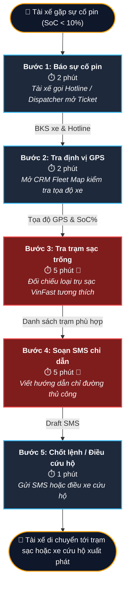
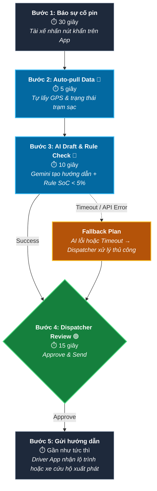

# 🖼️ Phase 3.1 — Current-State & Future-State Workflow Diagrams

**Dự án:** Trợ lý AI Điều vận & Xử lý Sự cố Pin Thực địa (GSM / Xanh SM)

**Đơn vị:** Vin Smart Future — Tập đoàn Vingroup

**Tác giả:** Nguyễn Văn An (Leader) & VinSmart AI Innovators

---

# 📊 1. Current-State Workflow Diagram (Sơ đồ Quy trình Hiện tại)

Sơ đồ thể hiện quy trình thủ công gồm **5 bước** mà điều phối viên (Dispatcher) thực hiện khi xử lý sự cố hết pin của tài xế Xanh SM.



---

# ⏱️ 2. Bảng Phân Tích Chi Tiết Quy Trình Thủ Công

| Bước | Tên tác vụ                 | Actor         | Thời gian | Hệ thống tích hợp        | Bottleneck?     | Mô tả khó khăn & rủi ro                                                                                          |
| ---: | -------------------------- | ------------- | --------- | ------------------------ | --------------- | ---------------------------------------------------------------------------------------------------------------- |
|    1 | Tiếp nhận cuộc gọi sự cố   | Tài xế / CSKH | 2 phút    | Hotline → CRM Ticket     | ❌              | Tài xế hoảng hốt khi `SoC < 10%`, vị trí báo qua điện thoại có thể không chính xác.                              |
|    2 | Tra cứu định vị GPS xe     | Dispatcher    | 2 phút    | Biển số → CRM Map        | ❌              | Dispatcher nhập biển số để tìm vị trí và mức pin thực tế.                                                        |
|    3 | Tra cứu trạm sạc VinFast   | Dispatcher    | 5 phút    | GPS → VinFast Dashboard  | 🔴 Bottleneck 1 | Lọc thủ công loại trụ sạc (60kW/150kW/250kW), kiểm tra tương thích với VF5/VF8/e34 và trạng thái trống realtime. |
|    4 | Soạn tin nhắn hướng dẫn    | Dispatcher    | 5 phút    | Raw Data → Driver App    | 🔴 Bottleneck 2 | Soạn hướng dẫn bằng tay, dễ sai tên đường hoặc khoảng cách.                                                      |
|    5 | Điều xe cứu hộ / Chốt lệnh | Dispatcher    | 1 phút    | Dispatcher → Rescue Team | ❌              | Nếu `SoC < 5%`, kích hoạt xe sạc pin lưu động.                                                                   |

### Tổng kết

- **Tổng thời gian xử lý:** **15 phút / lượt sự cố**
- **Thời gian Bottleneck:** **10 / 15 phút (66,7%)**

---

# 🔮 3. Future-State Workflow Diagram (Quy trình Có AI)

Quy trình sau khi bổ sung **LLM Feature** kết hợp **Human-in-the-Loop (HITL)**.



---

# 📈 4. Bảng So Sánh Hiệu Quả (KPI Impact)

| Chỉ số                             | Current State      | Future State         | Cải thiện             |
| ---------------------------------- | ------------------ | -------------------- | --------------------- |
| Thời gian xử lý 1 sự cố            | 15 phút            | < 1 phút             | 🟢 Giảm 93,3%         |
| Thời gian tra cứu & soạn hướng dẫn | 10 phút            | 15 giây              | 🟢 Giảm 97,5%         |
| Độ chính xác trạm sạc              | ~85%               | ≥98%                 | 🟢 Tăng 13%           |
| Năng suất Dispatcher               | 4 sự cố/giờ        | >40 sự cố/giờ        | 🟢 Tăng khoảng 10 lần |
| Xử lý `SoC < 5%`                   | Có nguy cơ sai sót | Rule + HITL + Rescue | 🛡️ An toàn hơn        |

---

# 🛠️ 5. Hướng dẫn xuất file PNG / PDF

## Cách 1 — Từ file SVG

1. Mở `04-workflow-diagram.svg` bằng Chrome, Edge hoặc VS Code.
2. Nhấn **Ctrl + P**.
3. Chọn **Save as PDF** hoặc chụp màn hình lưu thành:

```text
04-workflow-diagram.png
```

---

## Cách 2 — Dùng Python

Thực thi:

```bash
python generate_diagram_png.py
```

Kết quả sẽ sinh file:

```text
04-workflow-diagram.png
```

tại thư mục gốc của dự án.
